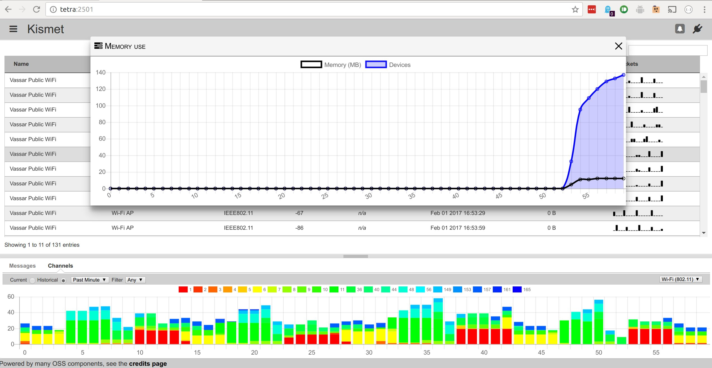

Title: Kismet
Authors: Nigel Bowden

# Kismet

Kismet is a wireless packet capture tool that allows you to view devices and networks within range. It provides many of the features of Wireshark, but only monitors wireless networks. delivered via an HTML interface.

To get to know more about Kismet, visit the [official web site][termshark_web_site].

[kismet_web_site]: https://www.kismetwireless.net/

<small> <i>Page last updated: {{ git_revision_date }} </i></small>
